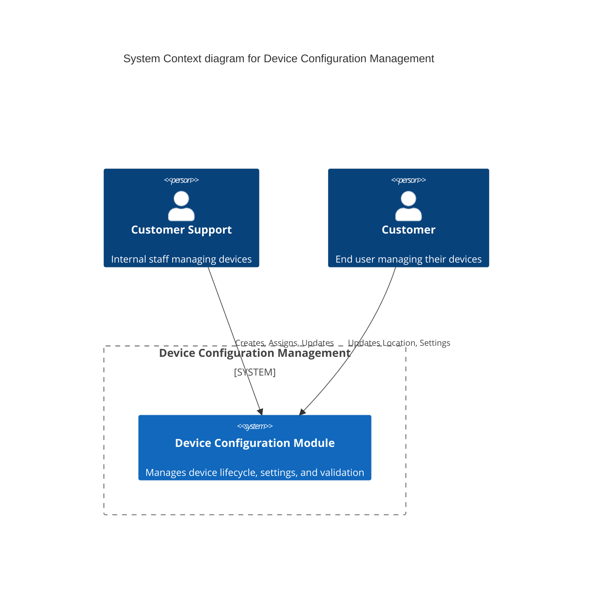

# Device Configuration Management

## Overview

The **Device Configuration Management** module is responsible for managing the lifecycle, configuration, and data
quality of devices. It ensures that devices are correctly configured, assigned to operators, and adhere to business
rules regarding visibility and usage.

## Business Context

This module addresses the need for high data quality and streamlined device management. It supports scenarios where
Customer Support or Customers update device details, ensuring that invalid configurations are flagged and handled.

### Business Goals

- **Maintain Data Quality**: Enforce rules for mandatory fields and consistent settings.
- **Streamline Management**: Simplify the process of creating, assigning, and updating devices.

### Actors

- **Customer Support**: Internal staff managing devices.
- **Customer**: End user managing their devices.

## Architecture

### C4 Context Diagram



### Event Storming

```mermaid
flowchart LR
%% Style Definitions
    classDef command fill: #a2d2ff, stroke: none, color: black, rx: 0, ry: 0, text-align: center;
    classDef event fill: #ffb380, stroke: none, color: black, rx: 0, ry: 0, text-align: center;
    classDef actor fill: #ffc8dd, stroke: none, color: black, rx: 0, ry: 0;
    classDef rule fill: none, stroke: none, color: #4a4a4a;
    classDef aggregate fill: #fff3bf, stroke: #e6cc00, stroke-width: 2px, color: black;
    classDef policy fill: #DCD0FF, stroke: #e6cc00, stroke-width: 2px, color: black;
    classDef module fill: none, stroke: none;
    classDef readmodel fill: #C1E1C1, stroke: none, color: black, rx: 0, ry: 0, text-align: center;

%% Actors
    ACT_CustomerSupport[Customer Support]:::actor
    ACT_Customer[Customer]:::actor
%% Module Scope
    subgraph DeviceConfigurationManagement [Device Configuration Management]

    %% Aggregate Scope
        subgraph DeviceConfigurationEditor [Device Configuration Editor]
            direction LR
        %% Rules
            R_NewDeviceDefaults[New device configured as unowned, null location, always open, default settings]:::rule
            R_DataQualityNotNull[Ownership, opening hours, and settings must be not null]:::rule
            R_OwnedDeviceBothSet[For owned devices, both operator and provider must be set]:::rule
            R_IdempotentAssignment[Device assignment is idempotent]:::rule
            R_UnownedResetToDefaults[Unowned devices reset location, opening hours, and settings to defaults]:::rule
            R_LocationCoordinatesMandatory[In location, longitude and latitude are mandatory]:::rule
            R_OperatorNotAssignedViolation[Monitor operator not assigned violation]:::rule
            R_ProviderNotAssignedViolation[Monitor provider not assigned violation]:::rule
            R_LocationMissingViolation[Monitor location missing violation]:::rule
            R_ShowOnMapMissingLocationViolation[Monitor show on map but missing location violation]:::rule
            R_ShowOnMapNoPublicAccessViolation[Monitor show on map but no public access violation]:::rule
        end

    %% Policy Scope
        subgraph VisibilityPolicy [Visibility Policy]
            direction LR
            R_VisibilityCalculation[Visibility calculated from violations validity and settings]:::rule
            R_IsPublicRule[Device is public if valid and public access enabled]:::rule
            R_IsVisibleRule[Device is visible if show on map enabled]:::rule
        end

        subgraph ValidationPolicy [Validation Policy]
            direction LR
            R_TenantIsolationRule[Operations require tenant membership]:::rule
        end
    end
    class DeviceConfigurationManagement module
    class DeviceConfigurationEditor aggregate
    class VisibilityPolicy policy
    class ValidationPolicy policy
%% Flow
    CMD_CreateDevice["\nCreate Device\n\n"]:::command
    CMD_AssignDevice["\nAssign Device\n\n"]:::command
    CMD_UpdateLocation["\nUpdate Location\n\n"]:::command
    CMD_UpdateSettings["\nUpdate Settings\n\n"]:::command
    CMD_UpdateOpeningHours["\nUpdate Opening Hours\n\n"]:::command
    EVT_DeviceCreated["\nDevice Created\n\n"]:::event
    EVT_OwnershipUpdated["\nOwnership Updated\n\n"]:::event
    EVT_LocationUpdated["\nLocation Updated\n\n"]:::event
    EVT_SettingsUpdated["\nSettings Updated\n\n"]:::event
    EVT_OpeningHoursUpdated["\nOpening Hours Updated\n\n"]:::event
    RM_DeviceConfiguration["\nDevice Configuration\n\n"]:::readmodel
    ACT_CustomerSupport --> CMD_CreateDevice
    ACT_CustomerSupport --> CMD_AssignDevice
    ACT_CustomerSupport --> CMD_UpdateLocation
    ACT_CustomerSupport --> CMD_UpdateSettings
    ACT_CustomerSupport --> CMD_UpdateOpeningHours
    ACT_Customer --> CMD_UpdateLocation
    ACT_Customer --> CMD_UpdateSettings
    CMD_CreateDevice --> R_NewDeviceDefaults
    CMD_CreateDevice --> R_DataQualityNotNull
    CMD_AssignDevice --> R_IdempotentAssignment
    CMD_AssignDevice --> R_OwnedDeviceBothSet
    CMD_AssignDevice --> R_UnownedResetToDefaults
    CMD_UpdateLocation --> R_LocationCoordinatesMandatory
    CMD_UpdateSettings --> R_DataQualityNotNull
    CMD_UpdateOpeningHours --> R_DataQualityNotNull
    R_NewDeviceDefaults --> EVT_DeviceCreated
    R_IdempotentAssignment --> EVT_OwnershipUpdated
    R_OwnedDeviceBothSet --> EVT_OwnershipUpdated
    R_UnownedResetToDefaults --> EVT_OwnershipUpdated
    R_LocationCoordinatesMandatory --> EVT_LocationUpdated
    R_DataQualityNotNull --> EVT_SettingsUpdated
    R_DataQualityNotNull --> EVT_OpeningHoursUpdated
    EVT_DeviceCreated --> RM_DeviceConfiguration
    EVT_OwnershipUpdated --> RM_DeviceConfiguration
    EVT_LocationUpdated --> RM_DeviceConfiguration
    EVT_SettingsUpdated --> RM_DeviceConfiguration
    EVT_OpeningHoursUpdated --> RM_DeviceConfiguration
%% Validation and Visibility Policies
    EVT_SettingsUpdated --> R_VisibilityCalculation
    EVT_LocationUpdated --> R_VisibilityCalculation
    EVT_OwnershipUpdated --> R_VisibilityCalculation
    R_VisibilityCalculation --> R_IsPublicRule
    R_VisibilityCalculation --> R_IsVisibleRule
    R_IsPublicRule --> R_ShowOnMapNoPublicAccessViolation
    R_IsVisibleRule --> R_ShowOnMapMissingLocationViolation
    R_OperatorNotAssignedViolation --> R_VisibilityCalculation
    R_ProviderNotAssignedViolation --> R_VisibilityCalculation
    R_LocationMissingViolation --> R_VisibilityCalculation
%% Tenant Isolation
    CMD_CreateDevice --> R_TenantIsolationRule
    CMD_AssignDevice --> R_TenantIsolationRule
    CMD_UpdateLocation --> R_TenantIsolationRule
    CMD_UpdateSettings --> R_TenantIsolationRule
    CMD_UpdateOpeningHours --> R_TenantIsolationRule
```

## Key Components

The module follows Domain-Driven Design (DDD) principles and Hexagonal Architecture (Ports & Adapters).

| Component                             | Type                     | Description                                                                                                       |
|---------------------------------------|--------------------------|-------------------------------------------------------------------------------------------------------------------|
| `DeviceConfigurationEditor`           | **Aggregate Root**       | Encapsulates the state and business logic for a device. Handles invariants and emits domain events.               |
| `DeviceService`                       | **Application Service**  | Orchestrates the flow of use cases. Manages transactions and interacts with the repository.                       |
| `DeviceController`                    | **Primary Adapter**      | REST API controller that exposes endpoints for device management.                                                 |
| `DeviceRepository`                    | **Secondary Port**       | Interface for device persistence.                                                                                 |
| `DeviceDocumentWithHistoryRepository` | **Secondary Adapter**    | Implementation of the repository. Persists the current state as a document and stores a history of domain events. |
| `DomainEvent`                         | **Domain Event**         | Sealed interface defining events like `LocationUpdated`, `OwnershipUpdated`, etc.                                 |
| `Violations`                          | **Value Object**         | Represents the validation state of a device, flagging missing or inconsistent data.                               |
| `Visibility`                          | **Value Object**         | Determines if the device is usable and visible to customers based on its validation state.                        |
| `Ownership`                           | **Value Object**         | Immutable record representing device ownership with operator and provider.                                        |
| `Location`                            | **Value Object**         | Immutable record representing device location with coordinates.                                                   |
| `Settings`                            | **Value Object**         | Immutable record representing device settings with boolean flags.                                                 |
| `OpeningHours`                        | **Value Object**         | Immutable record representing device opening hours.                                                               |
| `UpdateDevice`                        | **Data Transfer Object** | Record for applying updates to a device configuration.                                                            |
| `KafkaPublisher`                      | **Secondary Adapter**    | Publishes device configuration snapshots to Kafka for external systems.                                           |
| `InstallationFinishedListener`        | **Secondary Adapter**    | Listens to Kafka installation events and creates devices accordingly.                                             |

## Domain Logic

### 1. Device Lifecycle & Defaults

- **Creation**: New devices are created as `UNOWNED` with default settings (all false), no location, and "Always Open"
  opening hours.
- **Unassignment**: If a device is set to `UNOWNED` (operator and provider are null), its configuration is reset to
  defaults.

### 2. Validation (Violations)

The `Violations` class checks for the following conditions:

- **Operator/Provider Not Assigned**: If a device exists but the operator/provider is not assigned.
- **Location Missing**: If a device exists, but location is not defined.
- **Show On Map But Missing Location**: If settings.showOnMap is true but location is missing.
- **Show On Map But No Public Access**: If settings.showOnMap is true but settings.publicAccess is false.

### 3. Visibility Calculation

The `Visibility` of a device is derived from its `Violations` and `Settings`:

- **Inaccessible**: If there are critical violations (e.g., missing location).
- **Usable & Visible**: If valid and `showOnMap` is true.
- **Usable & Hidden**: If valid but `showOnMap` is false.

### 4. Event Sourcing / History

The system employs a hybrid persistence model:

- **State Persistence**: The current state of the device is stored as a JSON document (`DeviceDocumentEntity`).
- **Event History**: Every state change produces a `DomainEvent` which is stored in an append-only event log (
  `DeviceEventEntity`).
